# Category Learning (fMRI)

## Design

**Experimental Conditions:**  

* **Supervised Learning:** Category-relevant dimensions are given to participants (e.g., all friendly aliens have big noses)
* **Unsupervised Learning:** Participants learn categories by viewing multiple instances of the category.
* **Sparse categories:** Cohere on a single dimension (others can vary)
* **Dense categories:** Cohere on multiple dimensions (dimensions are correlated)

The experiment is a 2 (supervised vs. unsupervised) x 2 (sparse vs. dense) within-subjects design. All participants complete all conditions.

## Stimuli

In this experiment, there are 4 different categories (aliens, bugs, flags, and flowers). Two of the categories (flowers and flags) are sparse, while two of the categories (aliens and bugs) are dense.

All categories have 7 dimensions. For dense categories, 6 of these dimensions are correlated. The seventh dimensions is allowed to vary randomly. For sparse categories, 6 of the dimensions vary randomly. The seventh dimension is category-relevant and defines the category.

All dimensions have two levels (e.g., for hair shape in aliens -- curly and straight). Within each level of the dimension, there are two values to allow for more variability.

### Statistical Density

Statistical density is the method that Sloutsky and colleagues use to define categories. Dense categories have multiple intercorrelated features, while sparse categories have few relevant features. There are a few equations to calculate statistical density. I'll place them below.

Statistical density can vary between 0 and 1. Higher values (closer to 1) are dense, while lower values (closer to 0) are sparse.  

Hwithin is the entropy within the category.
Hbetween is the entropy between the category and contrasting categories. To find total entropy, we sum entropy due to varying dimension and entropy due to varying relations among dimensions.

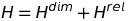

This equation is the same whether you are calculating within-category entropy or between-category entropy. To find entropy due to dimensions, you use the following formulas:

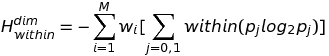  
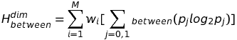

M is the total number of varying dimension.  
wi is the attentional weight of a particular dimension. For dimensions, we assume that this value is 1.0.  
pj is the probability of value *j* on dimension *i*.

Entropy due to relations uses the following formulas:

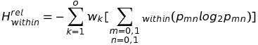  

O is the total number of possible dyadic relations among the varying dimensions.  
wk is the attentional weight of a relation. For relations, we use 0.5.  
pmn is the probability of the co-occurrence of values m and n on dimension k.

#### Calculating Statistical Density for my Stimuli
**Sparse Stimuli:**

M = 7  
wi = 1

For between-category entropy, all of the dimensions are the same. There is a 0.5 probability of each level of each dimensions being present. 

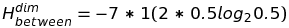  
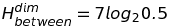  
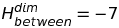  

For within-category entropy, the relevant dimension does not vary. So it does not contribute to the entropy. Its value goes to zero.

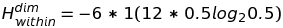  
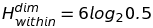  
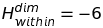

To calculate O (total number of possible dyadic relations among the dimensions), we use the following formula.

O = 21

Between categories (across the whole set), all dyadic relations have the same probability of co-occurrence (0.25). For each relation between dimensions, there are 4 possible combinations of the levels of those dimensions. They're all equally probable. So, we end up with the following.

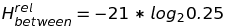

